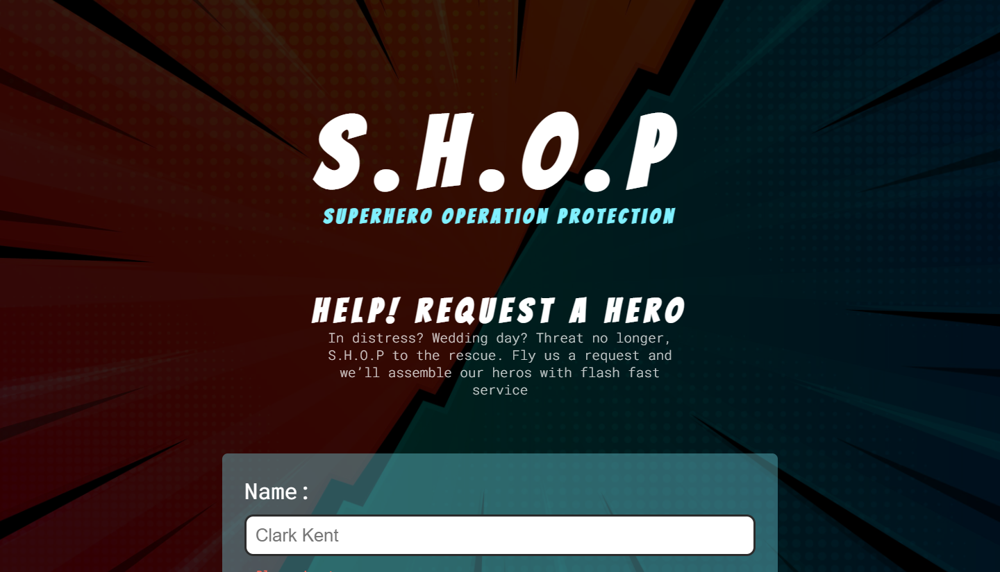

<h1>S.H.O.P - Survey Form</h1>
 This is a solution to the

[freeCodeCamp "Build a Tribute Page" challenge.](https://www.freecodecamp.org/learn/responsive-web-design/responsive-web-design-projects/build-a-survey-form).

freeCodeCamp is a non-profit organization that consists of an interactive learning web platform, an online community forum, chat rooms, online publications and local organizations that intend to make learning web development accessible to anyone.

<!-- REPLACE HREFS -->

<h2>Overview</h2>

  I needed practice with HTML forms and over time I have improved; this was a great start to my learning curve for inputs. I did a lot of research to get the inputs as I wanted
  and I believe it produced some nice results for a first 'form' related project.

